---
lab:
  title: Power BI에서 데이터 모델 디자인
  module: 4 - Design a Data Model in Power BI
---

# Power BI에서 데이터 모델 디자인

**이 랩의 예상 완료 시간은 45분입니다.**

이 랩에서는 데이터 모델 개발을 시작합니다. 테이블 간의 관계를 만든 후 테이블 및 열 속성을 구성하여 데이터 모델의 친숙성과 유용성을 향상하는 과정을 거칩니다. 또한 계층 구조를 만들고 빠른 측정값도 만듭니다.

이 랩에서는 다음 작업을 수행하는 방법을 알아봅니다.

- 모델 관계 만들기

- 테이블 및 열 속성 구성

- 계층 구조 만들기

### **랩 사례**

이 랩은 데이터 준비부터 보고서 및 대시보드로 게시에 이르기까지 배우기 위해 고안된 랩 시리즈 중 하나입니다. 어떤 순서로든 랩을 완료할 수 있습니다. 그러나 여러 랩을 진행하려는 경우 다음 순서를 따르는 것이 좋습니다.

1. Power BI Desktop에서 데이터 준비

2. Power BI Desktop에서 데이터 로드

3. **Power BI에서 데이터 모델 디자인**

4. Power BI Desktop에서 DAX 계산 만들기 1부

5. Power BI Desktop에서 DAX 계산 만들기, 2부

6. Power BI Desktop에서 보고서 디자인, 1부

7. Power BI Desktop에서 보고서 디자인, 2부

8. AI 시각적 개체를 사용하여 데이터 분석

9. Power BI 대시보드 만들기

10. 행 수준 보안 적용

## **연습 1: 모델 관계 만들기**

이 연습에서는 모델 관계를 만듭니다.

### **작업 1: 시작하기**

이 작업에서는 랩용 환경을 설정합니다.

*중요: 이전 랩에서 계속 진행해 온 경우(그리고 해당 랩을 성공적으로 완료한 경우) 이 작업을 완료하지 마세요. 대신, 다음 작업부터 진행하세요.*

1. Power BI Desktop을 열려면 작업 표시줄에서 Microsoft Power BI Desktop 바로 가기를 클릭합니다.

    

1. 팝업 창을 닫으려면 창 왼쪽 위의 **X**를 클릭합니다.

    

1. 시작 Power BI Desktop 파일을 열려면 **파일** 리본 탭을 클릭하여 Backstage 뷰를 엽니다.

1. **보고서 열기**를 선택합니다.

    

1. **보고서 찾아보기**를 클릭합니다.

    

1. **열기** 창에서 **D:\PL300\Labs\03-configure-data-model-in-power-bi-desktop\Starter** 폴더로 이동합니다.

1. **Sales Analysis** 파일을 선택합니다.

1. **열기**를 클릭합니다.

    

1. 열려 있는 정보 창을 모두 닫습니다.

1. 파일 복사본을 만들려면 **파일** 리본 탭을 클릭하여 Backstage 뷰를 엽니다.

1. **다른 이름으로 저장**을 선택합니다.

    

1. 변경 내용을 적용하라는 메시지가 표시되면 **적용**을 클릭합니다.

    

1. **다른 이름으로 저장** 창에서 **D:\PL300\MySolution** 폴더로 이동합니다.

1. **저장**을 클릭합니다.

    

### **작업 2: 모델 관계 만들기**

이 작업에서는 모델 관계를 만듭니다.

1. Power BI Desktop의 왼쪽에서 **모델** 뷰 아이콘을 클릭합니다.

    

2. 7개의 테이블이 모두 보이지 않으면 오른쪽 방향으로 가로 스크롤한 후 동시에 모두 볼 수 있도록 테이블을 더 가깝게 끌어서 정렬합니다.

    *팁: 창 아래쪽에 있는 확대/축소 컨트롤을 사용할 수도 있습니다.*

    모델 보기에서는 각 테이블 및 관계(테이블 간의 커넥터)를 볼 수 있습니다. 현재는 관계가 존재하지 않습니다. 이전 **Power BI Desktop에서 데이터 준비** 랩에서 데이터 로드 관계 옵션을 사용하지 않도록 설정했기 때문입니다.

3. 보고서 뷰로 돌아가려면 왼쪽에서 **보고서** 뷰 아이콘을 클릭합니다.

    

4. 모든 테이블 필드를 보려면 **필드** 창에서 빈 영역을 마우스 오른쪽 단추로 클릭한 다음 **모두 확장**을 선택합니다.

    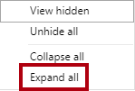

5. 테이블 시각적 개체를 만들려면 **필드** 창에서 **Product** 테이블의 **Category** 필드를 선택합니다.

    

    랩에서는 약식 표기법을 사용하여 필드를 참조합니다. 다음과 같이 표시됩니다. **Product \| Category**. 이 예에서 **Product**은 테이블 이름이고 **Category**는 필드 이름입니다.

6. 테이블에 열을 하나 더 추가하려면 **필드** 창에서 **Sales \| Sales** 필드를 선택합니다.

7. 테이블 시각적 개체에 4개의 제품 범주가 나열되며 각 범주의 판매 금액이 동일하고 합계에의 금액도 동일한 것을 볼 수 있습니다.

    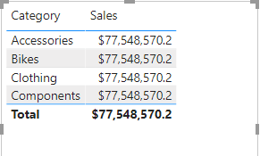

    문제는 이 테이블이 서로 다른 테이블에서 가져온 필드를 기반으로 한다는 점입니다. 각 제품 범주에 해당 범주에 대한 판매량이 표시되어야 합니다. 그러나 이러한 테이블 간에는 모델 관계가 없기 때문에 **Sales** 테이블은 필터링되지 않습니다. 이제 관계를 추가하여 테이블 간에 필터를 전파합니다.

8. **모델링** 리본 탭의 **관계** 그룹에서 **관계 관리**를 클릭합니다.

    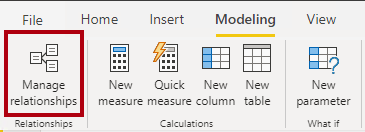

9. **관계 관리** 창에서 관계가 아직 정의되지 않은 것을 볼 수 있습니다.

10. 관계를 만들려면 **새로 만들기**를 클릭합니다.

    

11. **관계 만들기** 창의 첫 번째 드롭다운 목록에서 **Product** 테이블을 선택합니다.

    

12. 두 번째 드롭다운 목록(**Product** 테이블 그리드 아래)에서 **Sales** 테이블을 선택합니다.

    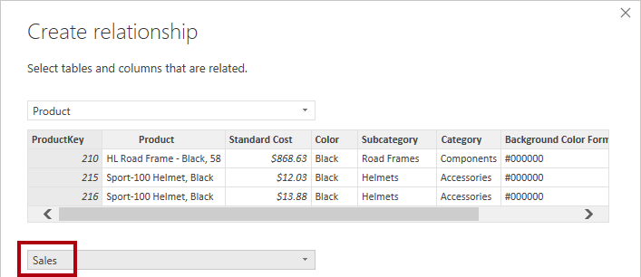

13. 각 테이블에서 **ProductKey** 열이 자동으로 선택되었음을 확인합니다.

    열은 동일한 이름 및 데이터 형식을 공유하기 때문에 선택되었습니다.

14. **카디널리티** 드롭다운 목록에서 **일대다(1:*)** 가 선택되어 있는 것을 볼 수 있습니다.

    카디널리티는 자동으로 검색되었습니다. Power BI에서 **Product** 테이블의 **ProductKey** 열에 고유한 값이 포함된다는 것을 인식하기 때문입니다. 일대다 관계는 가장 일반적인 카디널리티이며, 이 랩에서 만드는 모든 관계가 이 유형입니다.

15. **교차 필터 방향** 드롭다운 목록에서 **단일**이 선택되어 있는 것을 볼 수 있습니다.

    단일 필터 방향은 필터가 “한 쪽”에서 “많은 쪽”으로 전파됨을 의미합니다. 이 경우 **Product** 테이블에 적용된 필터가 **Sales** 테이블에 전파되지만 반대 방향으로는 전파되지 않음을 의미합니다.

16. **Mark This Relationship Active**가 선택되어 있습니다.

    활성 관계는 필터를 전파합니다. 필터가 전파되지 않도록 관계를 비활성으로 표시할 수 있습니다. 테이블 간에 여러 관계 경로가 있는 경우 비활성 관계가 있을 수 있습니다. 이 경우 모델 계산은 특수 함수를 사용하여 활성화할 수 있습니다.

17. **확인**을 클릭합니다.

    

18. **관계 관리** 창에서 새 관계가 나열된 것을 확인한 다음 **닫기**를 클릭합니다.

    

19. 보고서에서 테이블 시각적 개체가 업데이트되어 각 제품 범주에 대해 서로 다른 값을 표시합니다.

    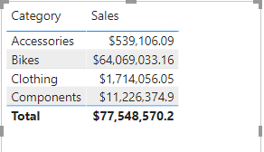

    **Product** 테이블에 적용된 필터가 이제 **Sales** 테이블로 전파됩니다.

20. 모델 뷰로 전환한 다음 이제 두 테이블 간에 커넥터가 있음을 확인합니다(두 테이블이 나란히 배치되어 있어도 관계없음).

    

21. 다이어그램을 통해 **1** 및 * 지표로 표시되는 카디널리티를 쉽게 이해할 수 있습니다.

    필터 방향은 화살촉으로 표현됩니다. 실선은 활성 관계를 나타냅니다. 파선은 비활성 관계를 나타냅니다.

22. 관계 위를 커서로 가리켜 관련 열을 강조 표시합니다.

    관계를 만드는 더 쉬운 방법이 있습니다. 모델 다이어그램에서 열을 끌어서 놓아 새 관계를 만들 수 있습니다.

23. 다른 기술을 사용하여 새 관계를 만들려면 **Reseller** 테이블에서 **ResellerKey** 열을 **Sales** 테이블의 **ResellerKey** 열로 끕니다.

    

    *팁: 열을 끌려오지 않는 경우도 있습니다. 이 상황이 발생하면 다른 열을 선택한 다음 다시 드래그하려는 열을 선택한 후에 다시 시도합니다. 다이어그램에 추가한 새 관계가 표시되는지 확인하세요.*

24. 새 기술을 사용하여 다음의 두 모델 관계를 만듭니다.

    - **Region \| SalesTerritoryKey**에서 **Sales \| SalesTerritoryKey**로

    - **Salesperson \| EmployeeKey**에서 **Sales \| EmployeeKey**로

25. 다이어그램에서 **Sales** 테이블이 다이어그램 가운데에 오고 관련 테이블이 근처에 정렬되어 있도록 테이블을 정렬합니다. 연결이 끊긴 테이블은 옆쪽에 배치합니다.

    

26. Power BI Desktop 파일을 저장합니다.

## **연습 2: 테이블 구성**

이 연습에서는 계층 구조를 만들고 열을 숨기고 서식을 지정하고 분류하여 각 테이블을 구성합니다.

### **작업 1: Product 테이블 구성**

이 작업에서는 **Product** 테이블을 구성합니다.

1. 필요한 경우, 모델 뷰의 **필드** 창에서 **Product** 테이블을 확장하여 모든 필드를 표시합니다.

2. 계층 구조를 만들려면 **필드** 창에서 **Category** 열을 마우스 오른쪽 단추로 클릭한 다음 **계층 구조 만들기**를 선택합니다.

    

3. **필드** 창의 왼쪽에 있는 **속성** 창에서 **이름** 상자에 있는 텍스트를 **Products**으로 바꿉니다.

    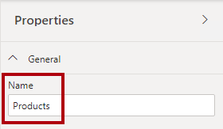

4. 계층 구조에 두 번째 수준을 추가하려면 **속성** 창의 **계층 구조** 드롭다운 목록에서 **Subcategory**를 선택합니다(창 내에서 아래쪽으로 스크롤해야 할 수 있음).

5. 계층 구조에 두 번째 수준을 추가하려면 **계층 구조** 드롭다운 목록에서 **Product**를 선택합니다.

6. 계층 구조 디자인을 완료하려면 **수준 변경 내용 적용**을 클릭합니다.

    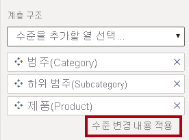

    *팁: **수준 변경 적용**을 클릭하는 것을 기억하도록 합니다. 이 단계를 간과해서 자주 실수가 발생합니다.*

7. **필드** 창에서 **Products** 계층 구조를 볼 수 있습니다.

    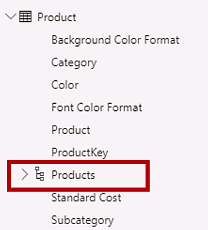

8. 계층 구조 수준을 표시하려면 **Products** 계층 구조를 확장합니다.

    

9. 열을 표시 폴더로 구성하려면 **필드** 창에서 먼저 **Background Color Format** 열을 선택합니다.

10. **Ctrl** 키를 누른 채로 **Font Color Format** 열을 선택합니다.

11. **속성** 창의 **표시 폴더** 상자에 **Formatting**을 입력합니다.

    

12. **필드** 창에서 두 개의 열이 이제 폴더 안에 있는 것을 볼 수 있습니다.

    

    표시 폴더는 특히 많은 필드로 구성된 테이블을 정리할 수 있는 좋은 방법입니다.

### **작업 2: Region 테이블 구성**

이 작업에서는 **Region** 테이블을 구성합니다.

1. **Region** 테이블에서 다음과 같은 세 가지 수준으로 **Regions**라는 계층 구조를 만듭니다.

    - Group

    - Country

    - Region

    

2. **Country** 열을 선택합니다(**Country** 계층 구조 수준 아님).

3. **속성** 창에서 **고급** 섹션(창 아래쪽에 있음)을 확장한 다음 **데이터 범주** 드롭다운 목록에서 **국가/지역**을 선택합니다.

    

    데이터 분류는 보고서 디자이너에게 힌트를 제공할 수 있습니다. 이 경우 열을 국가 또는 지역으로 분류하면 맵 시각화를 렌더링할 때 Power BI에 더 정확한 정보가 제공됩니다.

### **작업 3: Reseller 테이블 구성**

이 작업에서는 **Reseller** 테이블을 구성합니다.

1. **Reseller** 테이블에서 다음과 같은 두 가지 수준으로 **Resellers**라는 계층 구조를 만듭니다.

    - Business Type

    - Reseller

    

2. 다음 네 가지 수준으로 **Geography**라는 두 번째 계층 구조를 만듭니다.

    - Country-Region

    - State-Province

    - City

    - Reseller

    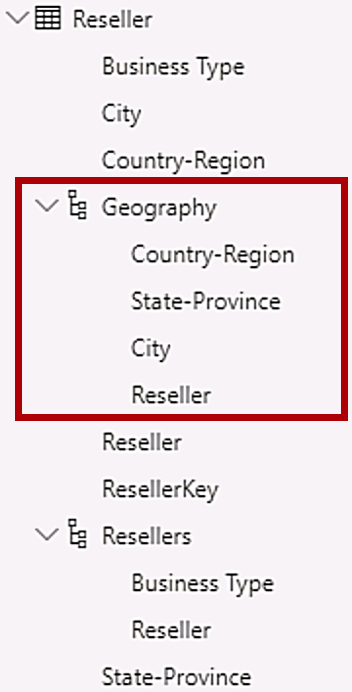

3. **Country-Region**, **State-Province**, **City** 열(계층 구조 수준 아님)에 대한 **데이터 범주**를 각각 **국가/지역**, **시/도** 및 **구/군/시**로 설정합니다. 

### **작업 4: Sales 테이블 구성**

이 작업에서는 **Sales** 테이블을 구성합니다.

1. **Sales** 테이블에서 **Cost** 열을 선택합니다.

2. **속성** 창의 **설명** 상자에 **Based on standard cost**를 입력합니다.

    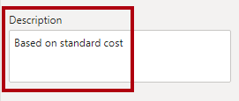

    *설명은 테이블, 열, 계층 구조 또는 측정값에 적용할 수 있습니다. **필드** 창에서 보고서 작성자가 필드 위로 커서를 가져가면 도구 설명에 설명 텍스트가 표시됩니다.*

3. **Quantity** 열을 선택합니다.

4. **속성** 창의 **서식** 섹션 내에서 **천 단위 구분 기호** 속성을 **예**로 전환합니다.

    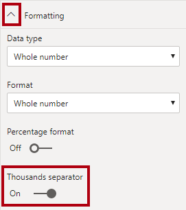

5. **Unit Price** 열을 선택합니다.

6. **속성** 창의 **서식** 섹션 내에서 **소수 자릿수** 속성을 **2**로 설정합니다.

7. **고급** 그룹(아래로 스크롤하여 찾아야 할 수도 있음)에 있는 **요약 기준** 드롭다운 목록에서 **평균**을 선택합니다.

    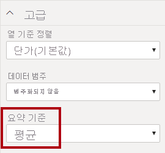

    기본적으로 숫자 열은 값을 합산하여 요약합니다. 이 기본 동작은 가격을 나타내는 **단가** 같은 열에 적합하지 않습니다. 기본 요약을 평균으로 설정하면 의미 있는 결과가 생성됩니다.

### **작업 5: 속성 대량 업데이트**

이 작업에서는 단일 대량 업데이트를 사용하여 여러 열을 업데이트합니다. 대량 작업 방식으로 열을 숨기고 열 값의 서식을 지정합니다.

1. **필드** 창에서 **Product \| ProductKey** 열을 선택합니다.

2. **Ctrl** 키를 누른 채로 다음 13개의 열을 선택합니다(여러 테이블에 분포됨).

    - Region \| SalesTerritoryKey

    - Reseller \| ResellerKey

    - Sales \| EmployeeKey
    
    - Sales \| ProductKey

    - Sales \| ResellerKey

    - Sales \| SalesOrderNumber

    - Sales \| SalesTerritoryKey

    - Salesperson \| EmployeeID

    - Salesperson \| EmployeeKey

    - Salesperson \| UPN

    - SalespersonRegion \| EmployeeKey

    - SalespersonRegion \| SalesTerritoryKey

    - Targets \| EmployeeID

3. **속성** 창에서 **숨김** 속성을 **켬**으로 밉니다.

    

    열은 관계에서 사용되거나 행 수준 보안 구성 또는 계산 논리에 사용되기 때문에 숨겨져 있습니다.

    **Power BI Desktop에서 DAX 계산 만들기, 1부** 랩에서 계산에 **SalesOrderNumber**를 사용합니다.

4. 다음 세 개의 열을 다중 선택합니다.

    - Product \| Standard Cost

    - Sales \| Cost

    - Sales \| Sales

5. **속성** 창의 **서식** 섹션 내에서 **소수 자릿수** 속성을 **0**(숫자 영)으로 설정합니다.

    

## **연습 3: 모델 인터페이스 검토**

이 연습에서는 보고서 뷰로 전환해서 모델 인터페이스를 검토합니다.

### **작업 1: 모델 인터페이스 검토**

이 작업에서는 보고서 뷰로 전환하고 모델 인터페이스를 검토합니다.

1. 보고서 뷰로 전환합니다.

2. **필드** 창에서 다음을 볼 수 있습니다.

    - 열, 계층 구조 및 수준은 보고서의 시각적 개체를 구성하는 데 사용할 수 있는 필드입니다.

    - 보고서 작성과 관련된 필드만 표시됩니다.

    - 모든 필드가 숨겨져 있기 때문에 **SalespersonRegion** 테이블이 표시되지 않습니다.

    - **Region** 테이블과 **Reseller** 테이블의 공간 필드에 공간 아이콘이 함께 표시됩니다.

    - 시그마 기호(Ʃ)로 표시된 필드는 기본적으로 요약됩니다.

    - **Sales \| Cost** 필드 위로 커서를 가져가면 도구 설명이 나타납니다.

3. **Sales \| OrderDate** 필드를 확장하면 날짜 계층 구조가 표시되는 것을 볼 수 있습니다.

    

    **Targets \| TargetMonth** 필드도 비슷한 계층 구조를 제공합니다. 이러한 계층 구조는 분석가가 직접 만든 것이 아니라 자동으로 생성된 것입니다. 그러나 문제가 있습니다. Adventure Works의 회계 연도는 매년 7월 1일에 시작되지만 그러나 이러한 자동 생성 날짜 계층 구조에서 날짜 계층 구조 연도는 매년 1월 1일에 시작됩니다.

    따라서 이 자동 동작을 비활성화하겠습니다. **Power BI Desktop에서 DAX 계산 만들기, 1부** 랩에서 DAX를 사용하여 날짜 테이블을 만든 다음, Adventure Works의 일정을 정의하도록 구성할 것입니다.

4. 자동 날짜/시간을 사용하지 않으려면 **파일** 리본 탭을 클릭하여 Backstage 뷰를 엽니다.

5. 왼쪽에서 **옵션 및 설정**을 선택한 다음, **옵션**을 선택합니다.

    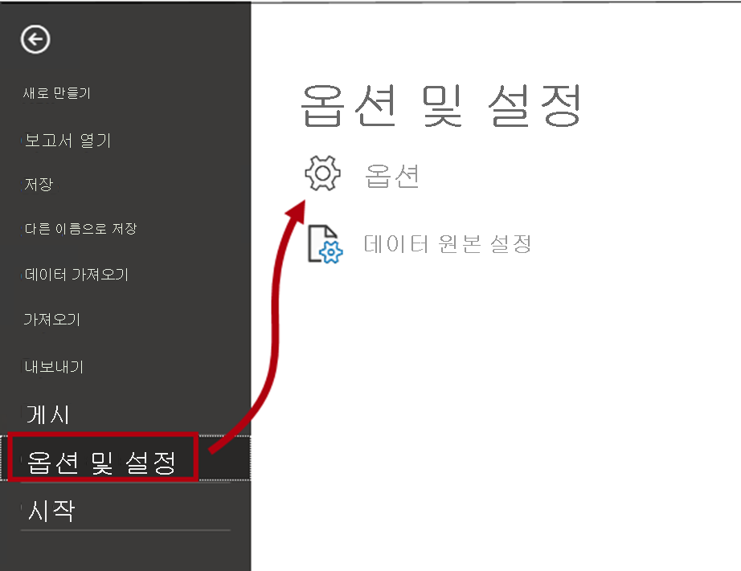

6. **옵션** 창의 왼쪽에 있는 **현재 파일** 그룹에서 **데이터 로드**를 선택합니다.

    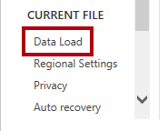

7. **시간 인텔리전스** 섹션에서 **자동 날짜/시간**을 선택 취소합니다.

    

8. **확인**을 클릭합니다.

    

9. **필드** 창에서 날짜 계층 구조를 더 이상 사용할 수 없다는 것을 알 수 있습니다.

    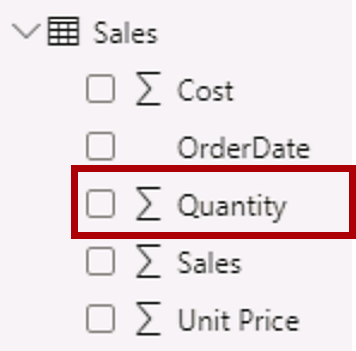

## **연습 4: 빠른 측정값 만들기**

이 연습에서는 두 개의 빠른 측정값을 만듭니다.

### **작업 1: 빠른 측정값 만들기**

이 작업에서는 수익과 수익률을 계산하는 두 가지 빠른 측정을 만들겠습니다.

1. **필드** 창에서 **Sales** 테이블을 마우스 오른쪽 단추로 클릭한 다음 **새 빠른 측정**을 선택합니다.

    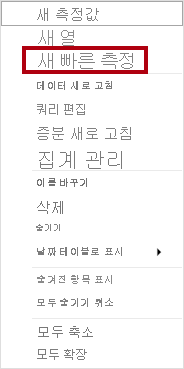

2. **빠른 측정** 창에서 **계산** 드롭다운 목록의 **수학 연산** 그룹 내에서 **빼기**를 선택합니다.

    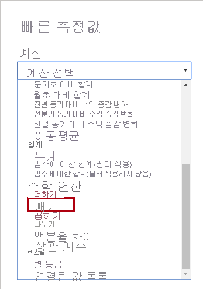

3. **빠른 측정** 창의 **필드** 창에서 **Sales** 테이블을 확장합니다.

4. **Sales** 필드를 **기준 값** 상자에 drag-and-drop 시킵니다.

5. **Cost** 필드를 **비용** 상자로 drag-and-drop 시킵니다.

    

6. **확인**을 클릭합니다.

    

    빠른 측정값에서 계산 수식이 자동으로 작성됩니다. 간단하고 일반적인 계산을 쉽고 빠르게 만들 수 있습니다. **Power BI Desktop에서 DAX 계산 만들기, 1부** 랩에서 이 도구를 사용하지 않고 측정값을 만듭니다.

7. **필드** 창의 **Sales** 테이블에서 새 측정값을 알 수 있습니다.

    

    측정에는 계산기 아이콘이 표시됩니다.

8. 측정의 이름을 바꾸려면 측정을 마우스 오른쪽 단추로 클릭한 다음 **이름 바꾸기**를 선택합니다.

    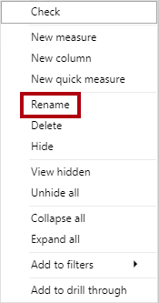

    *팁: 필드의 이름을 바꾸려면 필드를 두 번 클릭하거나 선택한 후 **F2** 키를 누릅니다.*

9. 측정의 이름을 **Profit**으로 바꾼 다음 **Enter**.키를 누릅니다.

10. **Sales** 테이블에서 다음 요구 사항에 따라 두 번째 빠른 측정을 추가합니다.

    - **나누기** 수학 연산 사용

    - **Numerator**를 **Sales \| Profit** 필드로 설정

    - **Denominator**를 **Sales \| Sales** 필드로 설정

    - 측정의 이름을 **Profit Margin**으로 바꾸기

    

    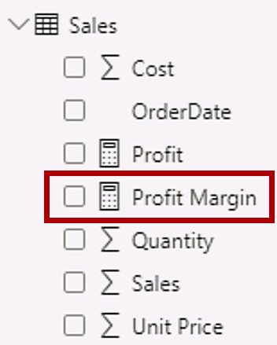

11. **Profit Margin** 측정이 선택되었는지 확인한 다음 **측정 도구** 상황별 리본에서 형식을 **백분율**(소수 자릿수 2개 사용)로 설정합니다.

    

12. 두 측정을 테스트하려면 먼저 보고서 페이지에서 테이블 시각적 개체를 선택합니다.

13. **필드** 창에서 두 측정을 확인합니다.

    

14. 오른쪽 안내선을 클릭한 후 끌어서 테이블 시각적 개체의 너비를 늘립니다.

    

15. 측정이 올바른 형식으로 합당한 결과를 산출하는지 확인합니다.

    

### **작업 2: 다대다 관계 만들기**

이 작업에서는 **Salesperson** 테이블과 **Sales** 테이블 간에 다대다 관계를 만듭니다.

1. Power BI Desktop에서 보고서 뷰의 **필드** 창에서 다음 두 필드를 선택하여 테이블 시각적 개체를 만듭니다.

    - Salesperson \| Salesperson

    - Sales \| Sales

    랩에서는 약식 표기법을 사용하여 필드를 참조합니다. 다음과 같이 표시됩니다. **Salesperson \| Salesperson** . 이 예에서 **Salesperson**은 테이블 이름이고 **Salesperson**은 필드 이름입니다.

    

    테이블에는 각 판매원이 달성한 판매량이 표시됩니다. 그러나 영업 직원과 판매 간에는 또 다른 관계가 있습니다. 일부 판매원은 한 개, 두 개 또는 그 이상의 판매 지역에 속합니다. 또한 판매 지역에는 여러 판매원이 할당될 수 있습니다.

    성과 관리 측면에서 영업 직원의 판매량(할당된 지역을 기준으로 함)을 분석하고 판매 목표와 비교해야 합니다. 다음 연습에서 이 분석을 지원하는 관계를 만듭니다.

2. Michael Blythe의 판매 금액이 거의 900만 달러인 것을 확인합니다.

3. 모델 뷰로 전환합니다.

    

4. **SalespersonRegion** 테이블을 끌어 **Region** 테이블과 **Salesperson** 테이블 사이에 배치합니다.

5. 끌어서 놓기 방식을 사용하여 다음 두 가지 모델 관계를 만듭니다.

    - **Salesperson \| EmployeeKey**와 **SalespersonRegion \| EmployeeKey**

    - **Region \| SalesTerritoryKey**와 **SalespersonRegion \| SalesTerritoryKey**

    **SalespersonRegion** 테이블을 브리징 테이블로 간주할 수 있습니다.

6. 보고서 뷰로 전환하면 시각적 개체가 업데이트되지 않은 것을 볼 수 있습니다. 즉, Michael Blythe의 판매량이 변경되지 않았습니다.

7. 다시 모델 뷰로 전환한 다음 **Salesperson** 테이블에서 관계 필터 방향(화살촉)을 따릅니다.

    고려 사항: **Salesperson** 테이블은 **Sales** 테이블을 필터링합니다. Salesperson 테이블은 **SalespersonRegion** 테이블도 필터링하지만 **Region** 테이블로 필터를 전파하여 필터링을 계속 진행하지는 않습니다(화살촉이 잘못된 방향을 가리키고 있음).

    

8. **Region** 테이블과 **SalespersonRegion** 테이블 간의 관계를 편집하려면 관계를 두 번 클릭합니다.

9. **관계 편집** 창의 **교차 필터 방향** 드롭다운 목록에서 **모두**를 선택합니다.

10. **보안 필터를 양방향으로 적용** 확인란을 선택합니다.

    

11. **확인**을 클릭합니다.

    

12. 관계에 이중 화살촉이 있는 것을 볼 수 있습니다.

    

13. 보고서 뷰로 전환한 다음 판매 값이 아직 변경되지 않은 것을 확인합니다.

    이제 문제는 **Salesperson** 테이블과 **Sales** 테이블 간에 가능한 두 가지 필터 전파 경로가 있다는 사실과 관련이 있습니다. 이러한 모호성은 내부적으로 “최소 테이블 수” 평가를 기반으로 해결됩니다. 필터링을 명확하게 적용하려면 이러한 유형의 모호성이 있는 모델을 디자인해서는 안 됩니다. 이 문제는 이 랩의 뒷부분에서 **Power BI Desktop에서 DAX 계산 만들기, 1부** 랩을 완료하면 일부 해결됩니다.

14. 모델 뷰로 전환합니다.

15. 브리징 테이블을 통해 필터 전파를 강제로 적용하려면 **Salesperson** 및 **Sales** 테이블 간의 관계를 편집(두 번 클릭)합니다.

16. **관계 편집** 창에서 **이 관계를 활성으로 만들기** 확인란을 선택 취소합니다.

    

17. **확인**을 클릭합니다.

    

    이제는 활성 경로로만 필터가 전파됩니다.

18. 다이어그램에서 비활성 관계가 파선으로 표현되는 것을 볼 수 있습니다.

    

19. 보고서 뷰로 전환하면 Michael Blythe의 판매량이 거의 2200만 달러인 것을 볼 수 있습니다.

    

20. 또한 각 영업 사원의 판매액(추가 된 경우)이 테이블 총액을 초과합니다.

    이 경우는 지역 판매 결과의 두 배, 세 배 등으로 계산되므로 일반적으로 다대다 관계입니다. 목록에 두 번째로 나온 영업 직원인 Brian Welcker를 보면, 판매 금액이 총 판매 금액과 같습니다. 맞는 결과입니다. Brian Welcker는 판매 담당 이사이고 이 사람의 판매량은 모든 지역의 판매량으로 측정되기 때문입니다.

    다대다 관계가 작동하는 동안에는 이제 영업 직원이 달성한 판매량을 분석할 수 없습니다(관계가 비활성 상태이므로). **Power BI Desktop에서 DAX 계산 만들기, 1부** 랩에서 계산된 테이블을 도입하면 (성과 분석을 위해) 영업 직원에게 할당된 판매 지역의 판매량을 분석할 수 있는 관계를 다시 활성화할 수 있습니다.

21. 모델링 뷰로 전환한 후 다이어그램에서 **Salesperson** 테이블을 선택합니다.

22. **속성** 창의 **이름** 상자에서 텍스트를 **Salesperson(Performance)** 으로 바꿉니다.

    이제 이름이 변경된 테이블은 할당된 판매 지역의 판매량을 기반으로 영업 사원의 실적을 보고하고 분석하는 데 사용됩니다.

### **작업 3: Targets 테이블 관계**

이 작업에서는 **Targets** 테이블에 대한 관계를 만듭니다.

1. **Salesperson (Performance) \| EmployeeID** 열 및 **Targets \| EmployeeID** 열에서 관계를 만듭니다.

2. 보고서 뷰에서 테이블 시각적 개체에 **Targets \| Target** 필드를 추가합니다.

3. 모든 열이 표시되도록 테이블 시각적 개체의 크기를 조정합니다.

    

    이제 판매와 목표를 시각화할 수 있지만 주의해야 할 부분이 두 가지 있습니다. 첫째, 기간을 기준으로 한 필터가 없으므로 목표(향후 목표 금액 포함)를 기준으로 한 필터도 없습니다. 둘째, 목표는 가산되지 않으므로, 합계가 표시되지 않습니다. 목표는 시각적 개체의 서식을 지정하여 사용하지 않도록 설정하거나 계산 논리를 사용하여 제거할 수 있습니다. **Power BI Desktop에서 DAX 계산 만들기, 2부** 랩에서는 둘 이상의 영업 직원이 필터링될 때 공백을 반환하는 목표 측정값을 만들어 두 번째 접근 방식을 따릅니다.

### **작업 4: 완료**

이 작업에서는 랩을 완료합니다.

1. Power BI Desktop 파일을 저장합니다.

2. 쿼리를 적용할지 묻는 프롬프트가 표시되면 **나중에 적용**을 클릭합니다.

3. 다음 랩을 시작하려는 경우 Power BI Desktop을 열어 둡니다.
