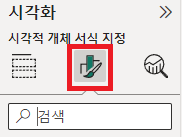
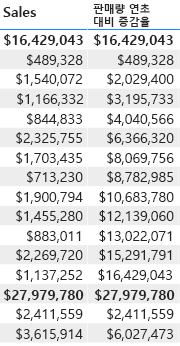
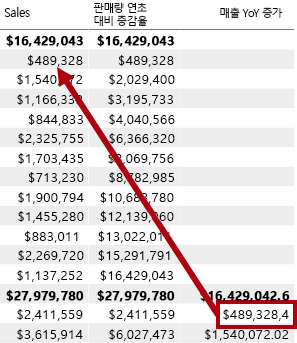

---
lab:
  title: 'Power BI Desktop에서 DAX 계산 만들기, 2부'
  module: 5 - Create Model Calculations using DAX in Power BI
---


# Power BI Desktop에서 DAX 계산 만들기, 2부

**이 랩의 예상 완료 시간은 45분입니다.**

이 랩에서는 필터 컨텍스트 조작을 포함하는 DAX 식을 사용하여 측정값을 만듭니다.

이 랩에서는 다음 작업을 수행하는 방법을 알아봅니다.

- CALCULATE() 함수를 사용하여 필터 컨텍스트를 조작

- 시간 인텔리전스 함수를 사용

### **랩 사례**

이 랩은 데이터 준비부터 보고서 및 대시보드로 게시에 이르기까지 전체 사례로 고안된 랩 시리즈 중 하나입니다. 어떤 순서로든 랩을 완료할 수 있습니다. 그러나 여러 랩을 진행하려는 경우 다음 순서를 따르는 것이 좋습니다.

1. Power BI Desktop에서 데이터 준비

2. Power BI Desktop에서 데이터 로드

3. Power BI에서 데이터 모델 디자인

4. Power BI Desktop에서 DAX 계산 만들기, 1부

5. **Power BI Desktop에서 DAX 계산 만들기, 2부**

6. Power BI Desktop에서 보고서 디자인, 1부

7. Power BI Desktop에서 보고서 디자인, 2부

8. AI 시각적 개체를 사용하여 데이터 분석

9. Power BI 대시보드 만들기

10. 행 수준 보안 적용

## **연습 1: 필터 컨텍스트 사용**

이 연습에서는 필터 컨텍스트 조작을 포함하는 DAX 식을 사용하여 측정값을 만듭니다.

### **작업 1: 시작하기**

이 작업에서는 랩용 환경을 설정합니다.

*중요: 이전 랩에서 계속 진행해 온 경우(그리고 해당 랩을 성공적으로 완료한 경우) 이 작업을 완료하지 마세요. 대신, 다음 작업부터 진행하세요.*

1. Power BI Desktop을 열려면 작업 표시줄에서 Microsoft Power BI Desktop 바로 가기를 클릭합니다.

    

1. 시작 창을 닫으려면 창 왼쪽 위의 **X**를 클릭합니다.

    

1. 시작 Power BI Desktop 파일을 열려면 **파일** 리본 탭을 클릭하여 Backstage 뷰를 엽니다.

1. **보고서 열기**를 선택합니다.

    

1. **보고서 찾아보기**를 클릭합니다.

    

1. **열기** 창에서 **D:\PL300\Labs\05-create-dax-calculations-in-power-bi-desktop-advanced\Starter** 폴더로 이동합니다.

1. **판매 분석** 파일을 선택합니다.

1. **열기**를 클릭합니다.

    

1. 열려 있는 정보 창을 모두 닫습니다.

1. 파일 복사본을 만들려면 **파일** 리본 탭을 클릭하여 Backstage 뷰를 엽니다.

1. **다른 이름으로 저장**을 선택합니다.

    

1. 변경 내용을 적용하라는 메시지가 표시되면 **적용**을 클릭합니다.

    

1. **다른 이름으로 저장** 창에서 **D:\PL300\MySolution** 폴더로 이동합니다.

1. **저장**을 클릭합니다.

    

### **작업 2: 행렬 시각적 개체 만들기**

이 작업에서는 새 측정값 테스트를 지원할 행렬 시작적 개체를 만듭니다.

1. Power BI Desktop의 보고서 뷰에서 새 보고서 페이지를 만듭니다.

    

2. **3페이지**에서 행렬 시각적 개체를 추가합니다.

    

3. 전체 페이지를 채우도록 행렬 시각적 개체의 크기를 조정합니다.

4. 행렬 시각적 필드를 구성하려면 **필드** 창에서 **지역 \| 지역** 계층 구조를 끌어서 시각적 개체 안에 놓습니다.

    랩에서는 약식 표기법을 사용하여 필드나 계층 구조를 참조합니다. **지역 \| 지역과 같이 표시됩니다**.이 예에서 **지역**은 테이블 이름이고 **지역**은 계층 구조 이름입니다.

5. **판매 \| 판매** 필드도 추가합니다.

6. 전체 계층을 확장하려면 행렬 시각적 개체의 오른쪽 위에 있는 포크 모양 이중 화살표 아이콘을 두 번 클릭합니다.

    

    **지역** 계층 구조에 **그룹**, **국가**, **지역** 수준이 있습니다.

7. 시각적 개체의 서식을 지정하려면 **시각화** 창에서 **서식** 창을 선택합니다.

    

8. **검색** 상자에 **계단형**을 입력합니다.

9. **계단형 레이아웃** 속성을 **끄기**로 설정합니다.

    

10. 행렬 시각적 개체에 이제 열 머리글 네 개가 있는지 확인합니다.

    

    Adventure Works에서 판매 지역은 그룹, 국가, 지역으로 구성됩니다. 미국을 제외한 모든 국가에는 국가 이름을 따라 명명된 하나의 지역만 있습니다. 미국은 대규모 판매 지역이므로 다섯 개 판매 지역으로 나눠집니다.

    *이 연습에서는 여러 측정값을 만든 다음 행렬 시각적 개체에 추가하여 테스트합니다.*

### **작업 3: 필터 컨텍스트 조작**

이 작업에서는 CALCULATE() 함수를 사용하여 필터 컨텍스트를 조작하는 DAX 식으로 여러 측정값을 만듭니다.

1. 다음 식에 따라 **판매** 테이블에 측정값을 추가합니다.

    편의상 이 랩의 모든 DAX 정의를 **D:\PL300\Labs\05-create-dax-calculations-in-power-bi-desktop-advanced\Assets\Snippets.txt** 파일에서 복사할 수 있습니다.


    **DAX**


    ```
    Sales All Region =
    
    CALCULATE(SUM(Sales[Sales]), REMOVEFILTERS(Region))
    ```


    CALCULATE() 함수는 필터 컨텍스트를 조작하는 데 사용되는 강력한 함수입니다. 첫 번째 인수는 식 또는 측정값을 사용합니다(측정값은 단지 명명된 식입니다). 후속 인수를 사용하여 필터 컨텍스트를 수정할 수 있습니다.
    
    REMOVEFILTERS() 함수는 활성 필터를 제거합니다. 아무 인수도 사용하지 않거나 테이블, 열 또는 여러 열을 인수로 사용할 수 있습니다.
    
    이 수식에서 측정값은 수정된 필터 컨텍스트에서 **판매** 열의 합계를 평가하여 **지역** 테이블의 열에 적용된 필터를 모두 제거합니다.

2. **영업 전체 지역** 측정값을 행렬 시각적 개체에 추가합니다.

    

3. **Sales All Region** 측정값은 각 지역, 국가(소계) 및 그룹(소계)의 모든 지역 매출에 대한 합계를 계산합니다.

    새 측정은 아직 유용한 결과를 제공하지 않습니다. 그룹, 국가 또는 지역의 매출이 이 값으로 나눠지면 “총계의 백분율”이라고 하는 유용한 비율이 생성됩니다.

4. **필드** 창에서 **Sales All Region** 측정이 선택되었는지 확인하고(이 측정을 선택하면 배경이 진한 회색으로 표시됨) 수식 표시줄에서 측정값 이름과 수식을 다음 수식으로 바꿉니다.

    *팁: 기존 수식을 바꾸려면 먼저 코드 조각을 복사합니다. 그런 다음 수식 입력줄 내부를 클릭하고 **Ctrl + A**를 눌러 모든 텍스트를 선택합니다. 그런 다음 **Ctrl + V**를 눌러 코드 조각을 붙여넣어 선택한 텍스트를 덮어씁니다. 그런 다음, **Enter** 키를 누릅니다.*


    **DAX**


    ```
    Sales % All Region =  
    ‎DIVIDE(  
    ‎ SUM(Sales[Sales]),  
    ‎ CALCULATE(  
    ‎ SUM(Sales[Sales]),  
    ‎ REMOVEFILTERS(Region)  
    ‎ )  
    ‎)
    ```


    측정값의 이름이 변경되어 업데이트된 수식을 정확하게 반영합니다. DIVIDE() 함수는 **지역** 테이블에 적용된 모든 필터를 제거하는 수정된 컨텍스트의 **판매** 측정값으로 필터 컨텍스트에 의해 수정되지 않은 **판매** 측정값을 나눕니다.

5. 행렬 시각적 개체에서 측정값의 이름이 변경되고 각 그룹, 국가 및 지역에 대해 다른 값이 표시된 것을 볼 수 있습니다.

6. **Sales % All Region** 측정값을 소수점 이하 두 자리 백분율로 지정합니다.

7. 행렬 시각적 개체에서 **Sales % All Region** 측정값의 값을 검토합니다.

    

8. 다음 식을 기반으로 **Sales** 테이블에 다른 측정값을 추가하고 백분율로 서식을 지정합니다.


    **DAX**
    
    ```
    Sales % Country =  
    ‎DIVIDE(  
    ‎ SUM(Sales[Sales]),  
    ‎ CALCULATE(  
    ‎ SUM(Sales[Sales]),  
    ‎ REMOVEFILTERS(Region[Region])  
    ‎ )  
    ‎)
    ```


9. **Sales % Country** 측정값 수식은 **Sales % All Region** 측정값 수식과 약간 다릅니다.

    차이점은 **지역** 테이블의 모든 열이 아니라 **지역** 테이블의 **지역** 열에서 필터를 제거하여 분모가 필터 컨텍스트를 수정한다는 것입니다. 즉, 그룹 또는 국가 열에 적용된 필터는 유지됩니다. 그러면 매출을 국가의 백분율로 나타내는 결과가 얻어집니다.

10. 행렬 시각적 개체에 **Sales % Country** 측정값을 추가합니다.

11. 미국 내 지역에서만 100%가 아닌 값이 생성됩니다.

    

    미국에만 여러 지역이 있다는 점을 기억하세요. 다른 모든 국가가 100%인 이유는 모두 단일 지역으로 구성되어 있기 때문입니다.

12. 시각적 개체에서 이 측정값의 가독성을 향상시키기 위해 **Sales % Country** 측정값을 개선된 다음 수식으로 덮어씁니다.


    **DAX**


    ```
    Sales % Country =  
    ‎IF(  
    ‎ ISINSCOPE(Region[Region]),  
    ‎ DIVIDE(  
    ‎ SUM(Sales[Sales]),  
    ‎ CALCULATE(  
    ‎ SUM(Sales[Sales]),  
    ‎ REMOVEFILTERS(Region[Region])  
    ‎ )  
    ‎ )  
    ‎)
    ```


    IF() 함수 내에 포함된 ISINSCOPE() 함수는 지역 열이 수준 계층의 수준인지 여부를 테스트하는 데 사용됩니다. True로 설정되면 DIVIDE() 함수를 계산합니다. False 부분이 없으면 지역 열이 범위 내에 있지 않을 때 빈 값이 반환됨을 의미합니다.

13. 이제 지역이 범위 내에 있는 경우에만 **Sales % Country** 측정값이 값을 반환합니다.

    

14. 다음 식을 기반으로 **Sales** 테이블에 다른 측정값을 추가하고 백분율로 서식을 지정합니다.


    **DAX**


    ```
    Sales % Group =  
    ‎DIVIDE(  
    ‎ SUM(Sales[Sales]),  
    ‎ CALCULATE(  
    ‎ SUM(Sales[Sales]),  
    ‎ REMOVEFILTERS(  
    ‎ Region[Region],  
    ‎ Region[Country]  
    ‎ )  
    ‎ )  
    ‎)
    ```


    *매출을 그룹의 백분율로 구할 수 있도록 두 개의 열에서 필터를 효과적으로 제거하기 위해 두 개의 필터를 적용할 수 있습니다.*

15. 행렬 시각적 개체에 **Sales % Group** 측정값을 추가합니다.

16. 시각적 개체에서 이 측정값의 가독성을 향상시키기 위해 **Sales % Group** 측정값을 개선된 다음 수식으로 덮어씁니다.


    **DAX**


    ```
    Sales % Group =  
    ‎IF(  
    ‎ ISINSCOPE(Region[Region])  
    ‎ || ISINSCOPE(Region[Country]),  
    ‎ DIVIDE(  
    ‎ SUM(Sales[Sales]),  
    ‎ CALCULATE(  
    ‎ SUM(Sales[Sales]),  
    ‎ REMOVEFILTERS(  
    ‎ Region[Region],  
    ‎ Region[Country]  
    ‎ )  
    ‎ )  
    ‎ )  
    ‎)
    ```


17. 이제 지역 또는 국가가 범위 내에 있는 경우에만 **Sales % Group** 측정값이 값을 반환합니다.

18. 모델 뷰에서 3개의 새 측정값을 **Ratios**라는 표시 폴더에 추가합니다.

    

19. Power BI Desktop 파일을 저장합니다.

    **판매** 테이블에 추가된 측정값은 계층적 탐색을 수행하기 위해 수정된 필터 컨텍스트를 갖습니다. 소계 계산을 수행하는 패턴은 필터 컨텍스트에서 일부 열을 제거해야 하고, 총계를 계산하려면 모든 열을 제거해야 합니다.

## **연습 2: 시간 인텔리전스 사용**

이 연습에서는 매출 YTD(연간 누계) 측정값과 매출 YoY(전년 대비) 성장률 측정값을 만듭니다.

### **작업 1: YTD 측정값 만들기**

이 작업에서는 매출 YTD 측정값을 만듭니다.

1. 보고서 뷰의 **2페이지**에서 행렬 시각적 개체에는 행에 연수와 개월이 그룹화된 다양한 측정값이 표시됩니다.

2. 다음 식을 기반으로 하는 **Sales** 테이블에 측정값을 추가하고 소수점 이하 0자리로 지정합니다.


    **DAX**


    ```
    Sales YTD =  
    ‎TOTALYTD(SUM(Sales[Sales]), 'Date'[Date], "6-30")
    ```


    TOTALYTD() 함수는 지정된 날짜 열에 대해 식을 계산합니다. 이 경우 **판매** 열의 합계입니다. 날짜 열은 **Power BI Desktop에서 DAX 계산 만들기, 1부** 랩의 경우처럼 날짜 테이블로 표시된 날짜 테이블에 속해야 합니다.
    
    또한 함수는 연도의 마지막 날짜를 나타내는 세 번째 선택적 인수를 사용할 수 있습니다. 이 날짜가 없으면 12월 31일이 연도의 마지막 날짜입니다. Adventure Works의 경우 연도의 마지막 달이 6월이므로 “6-30”이 사용됩니다.

3. 행렬 시각적 개체에 **Sales** 필드와 **Sales YTD** 측정값을 추가합니다.

4. 그러면 해당 연도의 매출이 누적됩니다.

    

    TOTALYTD() 함수는 필터 조작, 특히 시간 필터 조작을 수행합니다. 예를 들어 2017년 9월(회계연도의 세 번째 월)의 YTD 매출을 계산하기 위해 **날짜** 테이블의 모든 필터가 제거되고 연도가 시작하는 날짜 2017년 7월 1일부터 컨텍스트 내 마지막 날짜 2017년 9월 30일까지의 새 필터로 대체됩니다.

    일반적인 시간 필터 조작을 지원하기 위해 DAX에서 많은 시간 인텔리전스 기능을 사용할 수 있습니다.

### **작업 2: YoY 증가율 측정값 만들기**

이 작업에서는 매출 YoY 성장률 측정값을 만듭니다.

1. 다음 식을 기반으로 **Sales** 테이블에 측정값을 추가합니다.


    **DAX**


    ```
    Sales YoY Growth =  
    ‎VAR SalesPriorYear =  
    ‎ CALCULATE(  
    ‎ SUM(Sales[Sales]),  
    ‎ PARALLELPERIOD(  
    ‎ 'Date'[Date],  
    ‎ -12,  
    ‎ MONTH  
    ‎ )  
    ‎ )  
    ‎RETURN  
    ‎ SalesPriorYear
    ```


    **판매 YoY 증가율** 측정값 수식은 변수를 선언합니다. 변수는 수식 논리를 단순화하는 데 유용할 수 있으며 수식 내에서 식을 여러 번 평가해야 하는 경우(YoY 증가율 논리의 경우) 더 효율적입니다. 변수는 고유 이름으로 선언되고, 측정값 식은 **RETURN** 키워드 후에 출력되어야 합니다.
    
    **SalesPriorYear** 변수에는 PARALLELPERIOD() 함수를 사용하여 필터 컨텍스트의 각 날짜에서 12개월 뒤로 이동하는 수정된 컨텍스트에서 **판매** 열의 합계를 계산하는 식이 할당됩니다.

2. 행렬 시각적 개체에 **Sales YoY Growth** 측정값을 추가합니다.

3. 새 측정값은 처음 12개월 동안은 BLANK를 반환합니다(2017 회계연도 이전에 기록된 매출이 없기 때문입니다).

4. **2018년 7월**에 대한 **Sales YoY Growth** 측정값은 **2017년 7월**에 대한 **Sales** 값입니다.

    

    *이제 수식의 "어려운 부분"을 테스트했으므로 증가율 결과를 계산하는 최종 수식으로 측정값을 덮어쓸 수 있습니다.*

5. 측정값을 완료하려면 이 수식을 사용하여 **Sales YoY Growth** 측정값을 덮어써 서식을 소수점 이하 두 자리 백분율로 지정합니다.


    **DAX**


    ```
    Sales YoY Growth =  
    ‎VAR SalesPriorYear =  
    ‎ CALCULATE(  
    ‎ SUM(Sales[Sales]),  
    ‎ PARALLELPERIOD(  
    ‎ 'Date'[Date],  
    ‎ -12,  
    ‎ MONTH  
    ‎ )  
    ‎ )  
    ‎RETURN  
    ‎ DIVIDE(  
    ‎ (SUM(Sales[Sales]) - SalesPriorYear),  
    ‎ SalesPriorYear  
    ‎ )
    ```


6. 수식의 **RETURN** 절에서 변수가 두 번 참조됩니다.

7. **2018 Jul**의 YoY 증가율이 **392.83%** 인지 확인합니다.

    

    즉, 2018년 7월 매출($2,411,559)이 전년도 동일 기간에 달성한 매출($489,328)에 비해 거의 400%(거의 4배) 향상되었음을 의미합니다.

8. 모델 뷰에서 두 개의 새 측정값을 **Time Intelligence**라는 표시 폴더에 넣습니다.

    

### **작업 3: 완료**

이 작업에서는 랩을 완료합니다.

1. 보고서 개발용으로 준비한 솔루션을 정리하려면 왼쪽 하단에서 **2페이지** 탭을 마우스 오른쪽 단추로 클릭한 다음 **페이지 삭제**를 선택합니다.

    

2. 페이지를 삭제할지 묻는 프롬프트가 표시되면 **삭제**를 클릭합니다.

    

3. **3페이지**도 삭제합니다.

4. 나머지 페이지에서 페이지를 지우려면 테이블 시각적 개체를 선택하고 **Delete** 키를 누릅니다.

5. Power BI Desktop 파일을 저장합니다.

6. 다음 랩을 시작하려는 경우 Power BI Desktop을 열어 둡니다.

    **Power BI Desktop에서 보고서 디자인, 1부** 랩에서 데이터 모델을 기반으로 보고서를 만듭니다.
